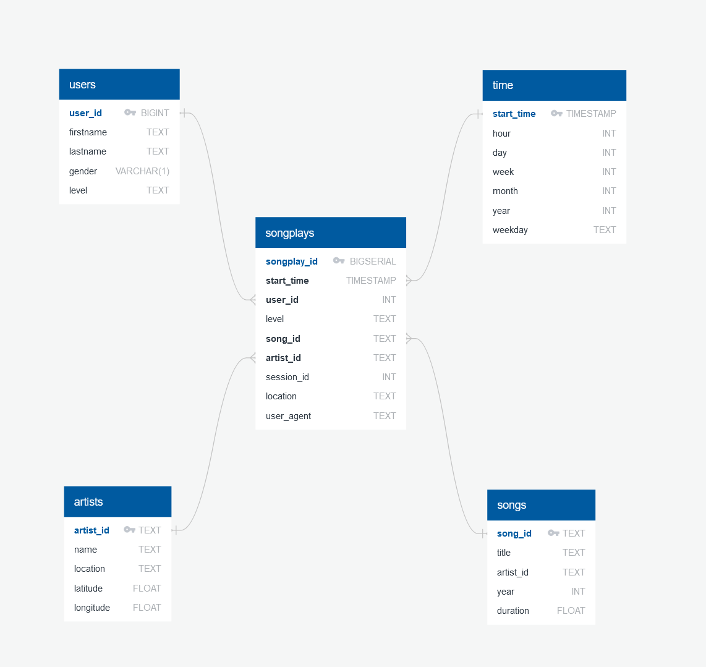

# Cloud Datawarehouse project - Udacity Data Engineer Nanodegree

## Project: Data Warehouse

### Context 

A music streaming startup, Sparkify, has grown their user base and song database and want to move their processes and data onto the cloud. Their data resides in S3, in a directory of JSON logs on user activity on the app, as well as a directory with JSON metadata on the songs in their app.

As their data engineer, you are tasked with building an ETL pipeline that extracts their data from S3, stages them in Redshift, and transforms data into a set of dimensional tables for their analytics team to continue finding insights in what songs their users are listening to. You'll be able to test your database and ETL pipeline by running queries given to you by the analytics team from Sparkify and compare your results with their expected results.

### Project Description
In this project, you'll apply what you've learned on data warehouses and AWS to build an ETL pipeline for a database hosted on Redshift. To complete the project, you will need to load data from S3 to staging tables on Redshift and execute SQL statements that create the analytics tables from these staging tables.

### Data Model

I have implemented star schema. It is the typical schema for a Data Warehouse and together with the snowflake model they are the most popular data warehouse schemas. In our scenario "songplays" will be fact table. Rest of the tables will be dimension tables. Till now our data warehouse was hosted locally on Postgres database, but now it will be hosted on AWS REDSHIFT.

#### Below there is a diagram for implemented Data Warehouse:

#### Below there is a descriptions for implemented Data Warehouse tables:

#### Staging tables:
- ___staging_events___ - staging table for log data
    - artist (TEXT)
    - auth (TEXT)
    - firstName (TEXT)
    - ItemInSession (TEXT), 
    - lastName (TEXT), 
    - length FLOAT, 
    - level (TEXT), 
    - location (TEXT), 
    - method (TEXT), 
    - page (TEXT), 
    - registration (TEXT), 
    - sessionId (INT), 
    - song (TEXT), 
    - status (INT), 
    - ts (TIMESTAMP), 
    - userAgent (TEXT), 
    - userId (INT)

- ___staging_songs___ - staging table for song data
    - song_id (TEXT PK), 
    - artist_id (TEXT), 
    - artist_latitude (FLOAT), 
    - artist_location (TEXT), 
    - artist_longitude (FLOAT), 
    - artist_name (TEXT), 
    - duration (FLOAT), 
    - num_songs (INT), 
    - title (TEXT), 
    - year (INT)

#### Fact tables:
- ___songplays___ - records in log data associated with song plays i.e. records with page NextSong
    - songplay_id (BIGINT, PRIMARY KEY)
    - start_time (TIMESTAMP, NOT NULL, FK, SORTKEY)
    - user_id (BIGINT, NOT NULL, FK)
    - level (TEXT, NOT NULL)
    - song_id (TEXT, NOT NULL FK)
    - artist_id (TEXT, NOT NULL FK, DISTKEY)
    - session_id (INT, NOT NULL)
    - location (TEXT, NOT NULL)
    - user_agent (TEXT, NOT NULL)
    
#### Dimension tables:
- ___users___ - users in the app
    - user_id (BIGINT, PRIMARY KEY, SORTKEY)
    - firstname (TEXT, NOT NULL)
    - lastname (TEXT, NOT NULL)
    - gender (TEXT, NOT NULL)
    - level (TEXT, NOT NUL)
    
    
- ___songs___ - songs in music database
    - song_id (TEXT, PRIMARY KEY, SORTKEY)
    - title (TEXT, NOT NULL)
    - artist_id (TEXT, NOT NULL)
    - year (INT, NOT NULL)
    - duration (FLOAT, NOT NUL)  
    
    
- ___artists___ - artists in music database
    - artist_id (TEXT, PRIMARY KEY, DISTKEY)
    - name (TEXT, NOT NULL)
    - location (TEXT, NOT NULL)
    - latitude (FLOAT, NOT NULL)
    - longitude (FLOAT, NOT NULL)
    
    
- ___time___ - timestamps of records in songplays broken down into specific units
    - start_time (TIMESTAMP, PRIMARY KEY, SORTKEY)
    - hour (INT, NOT NULL)
    - day (INT, NOT NULL)
    - week (INT, NOT NULL)
    - month (INT, NOT NULL)
    - year (INT, NOT NULL)
    - weekday (TEXT, NOT NULL)
    
    
    
### Project structure:

1. ___static_files___ - folder that contains static files (for example: picture of database schema)
2. ___create_tables.py___ - script to dtop and create tables
3. ___etl.py___ - ETL script (loading staging tables, inserting data)
4. ___README.md___ - project description
5. ___sql_queries.py___ - python script with all raw SQL queries

### Project steps:

##### Project has two main steps:

1. Creating database structure (create all tables).
2. Inserting data from S3 to AWS REDSHIFT  

### How to start project?

Firstly you need to create tables with following command:

`python create_tables.py`

then ETL script can be started with following command:

`python etl.py`

### Queries for songplay analysis

Sample queries for songplay analysis:

-    Getting five most-listened songs:

`SELECT songs.title, count(*)
FROM songplays
LEFT JOIN songs ON songplays.song_id = songs.song_id
GROUP BY songs.title
ORDER BY count(*) DESC
LIMIT 5;`

-    Getting five most-listened artists:

`SELECT artists.name, count(*)
FROM songplays
LEFT JOIN artists ON songplays.artist_id = artists.artist_id
GROUP BY artists.name
ORDER BY count(*) DESC
LIMIT 5;`

